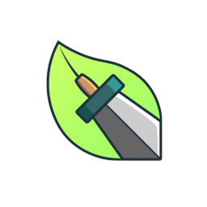

# EcoQuest

 
 A Game-based, Habit-Building Android Mobile Application for Solid Waste Management

# Installation Instructions
Download the EcoQuest-v1.3.apk file and install it in your Android phone.

# Description 
Improper disposal of solid wastes is a long-standing problem in the Philippines.

There are existing resources that attempt to teach and promote environmental awareness and proper waste management behavior. However, since these resources are typically presented and taught through traditional methods, some individuals may find this approach less engaging, leading to decreased interest and motivation. This, in turn, will make them more uninterested in building a habit for properly managing solid waste.

To address this problem, EcoQuest is developed to treat developing proper solid waste management habits like a game. By engaging the user using gamified learning, the app will act as a tool to help the users build a habit of properly managing waste disposal.
